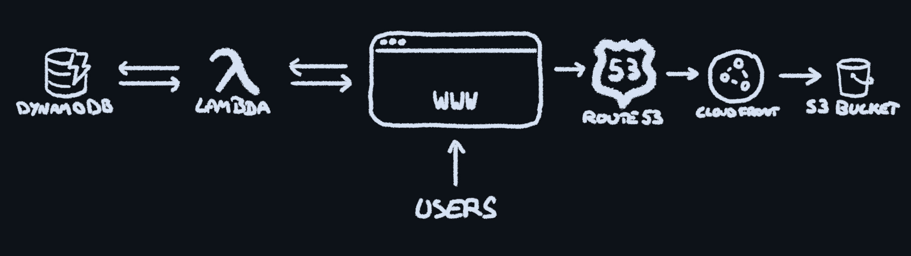

# Cloud Resume Challenge - AWS/CV Edition

       

## About
This repository contains the files used for my CV website, [cv.gatherer.tech](https://cv.gatherer.tech/). It was built following the framework laid out in the [Cloud Resume Challenge](https://cloudresumechallenge.dev).

## Architecture

When updates are made to the CV site, the changes are pushed to this GitHub repo. From here, a GitHub Action uploads the changed files to an AWS S3 bucket.

This S3 bucket is not publicly accessible for security reasons, and so the contents are shared on the web via CloudFront. DNS is handled by Route 53.

On the page is a view counter enabled by JavaScript. When the page is loaded, the JavaScript calls on an AWS Lambda function. This function (written in Python) reads the current view count from a DynamoDB databse, increments it by one, then shows it on the HTML page and stores the new value back in the table.

The diagram below shows how the various components interact with one another.

## Automation

After the aforementioned GitHub Action syncs the contents of the site/ folder to the S3 bucket, it runs an invalidation on the CloudFront cache by means of a bash script with AWS CLI commands. Instead of having the CloudFront Distribution ID mentioned in the code, I have the bash script query AWS and return all distributions, match the distribution with the project name via JQ, then extract the distribution ID from the JSON. The credentials are stored as GitHub environment variables to prevent hard-coding access keys (a bad move if ever I saw one). Said access keys correlate to an account with limited permissions that can only perform the required actions on the S3 bucket and CloudFront Distribution.

## To-Do

- [x] Change AWS CLI command permissions to use least privilege model
- [ ] Learn some Terraform
- [ ] Infrastructure as code via Terraform
- [ ] Add some tests to the Python code
- [x] Update CV to be... y'know... a CV
- [ ] Blog post about it
