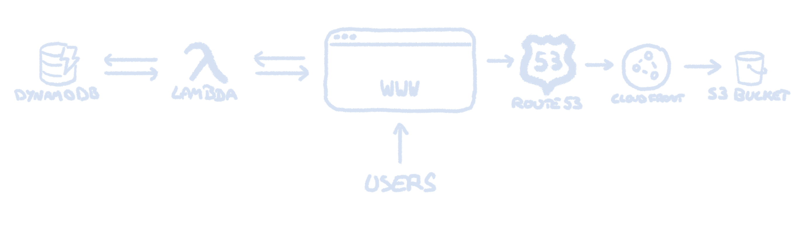

# Cloud Resume Challenge - AWS/CV Edition

This repository contains the files used for my CV website, [cv.gatherer.tech](https://cv.gatherer.tech/). It was built following the framework laid out in the [Cloud Resume Challenge](https://cloudresumechallenge.dev).

## Architecture

When updates are made to the CV site, the changes are pushed to this GitHub repo. From here, a GitHub Action uploades the changed files to an AWS S3 bucket.

This S3 bucket is not publicly accessible for security reasons, and so the contents are shared on the web via CloudFront. DNS is handled by Route 53.

On the page a view counter. The JavaScript on the page calls on an AWS Lambda function when loaded. This function (written in Python) reads the current view count from a DynamoDB databse, increments it by one, then shows it on the HTML page and stores the new value back in the table.

The diagram below shows how the various components interact with one another.

## To-Do

- [ ] Learn some Terraform
- [ ] Infrastructure as code via Terraform
- [ ] Add some tests to the Python code
- [ ] Update CV to be... y'know... a CV
- [ ] Blog post about it
